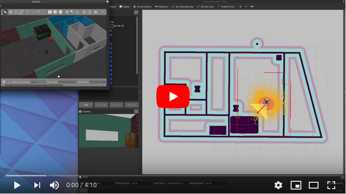

# Robotics Software Engineer Nanodegree Program

## Project 2/5: Go Chase It!

[](https://youtu.be/D5K0EeO6JMk)


[//]: # (Image References)

[image1]: ./documentation/gazebo.png "Gazebo"
[image2]: ./documentation/terminal.png "Terminal"
[image3]: ./documentation/rviz.png "Rviz"

### Project build instrctions:
1. Clone this repo inside the `src` folder of a catkin workspace.
2. Build workspace: `catkin_make`
3. Source environment: `source devel/setup.bash` 
4. Start the Gazebo simulation: `roslaunch my_robot world.launch`
5. Start the ball chaser nodes: `roslaunch ball_chaser ball_chaser.launch`

### Summary of Tasks:
In this project, I created two ROS packages inside the catkin_ws/src: the drive_bot and the ball_chaser. The robot starts inside the simulated world in Gazebo, and  it's chasing the white-colored balls.

#### 1) `drive_bot`:
* Create a my_robot ROS package to hold the robot, the white ball, and the world.
* Design a differential drive robot - here I designed a skid steer robot - with the Unified Robot Description Format (URDF). Add two sensors to the robot: a lidar and a camera. Add Gazebo plugins for the robot’s differential drive, lidar, and camera.
* House the robot inside the world I built in the previous Build My World project.
* Add a white-colored ball to the Gazebo world and save a new copy of this world.
* The world.launch file launches the world with the white-colored ball and the robot.

#### 2) `ball_chaser`:
* Create a ball_chaser ROS package to hold the C++ nodes.
* Write a drive_bot C++ node that provides a ball_chaser/command_robot service to drive the robot by controlling its linear x and angular z velocities. The service should publish to the wheel joints and return back the requested velocities.
* Write a process_image C++ node that reads the robot’s camera image, analyzes it to determine the presence and position of a white ball. If a white ball exists in the image, the node should request a service via a client to drive the robot towards it.
* The ball_chaser.launch should run both the drive_bot and the process_image nodes.


### Project structure:
```bash
tree

.Udacity-Robotics-ChaseTheBall                  # Go Chase It! Project
├── README.md                                   # Project documentation
├── documentation                               
│   ├── gazebo.png
│   ├── rviz.png
│   └── terminal.png
├── ball_chaser                                 # ball chaser node
│   ├── CMakeLists.txt                          # Link libraries
│   ├── launch                                  # Starts the drive_bot and process_image nodes
│   │   └── ball_chaser.launch
│   ├── package.xml
│   ├── src
│   │   ├── drive_bot.cpp                       # Sends the twist commands the robot
│   │   └── process_image.cpp                   # Calculates velcoities based on camera image
│   └── srv                                     # Custom DriveToTarget service description
│       └── DriveToTarget.srv
└── my_robot                                    # ball chaser node
    ├── CMakeLists.txt                          # Link libraries
    ├── launch
    │   ├── robot_description.launch
    │   └── world.launch                        # starts the Gazebo simulation in MyWorld.world
    ├── meshes                                  # custom meshes for the robot model
    │   ├── chassis.SLDPRT
    │   ├── chassis.STEP
    │   ├── chassis.dae
    │   ├── hokuyo.dae
    │   ├── wheel.SLDPRT
    │   ├── wheel.STEP
    │   └── wheel.dae
    ├── package.xml
    ├── rviz
    │   └── my_robot.rviz                       # RViz config file
    ├── urdf                                    # Robot URDF description
    │   ├── my_robot.gazebo                     # Skid steer, camera and lidar plugins
    │   └── my_robot.xacro
    └── worlds
        ├── MyWorld.world                       # Simulated world in Gazebo
        └── empty.world

```

### Remarks:
* To drive the robot inside Gazebo you can use the teleop_twist_keyboard that sends cmd_vel commands: http://wiki.ros.org/teleop_twist_keyboard
* However the project requested a differential drive robot, I implemented a 4 wheeled skid steer robot
* I designed custom 3D meshes, the source files can be found in the `meshes` folder of `my_robot` package
* The project was built in local environment using Gazebo 9
* Local environment was Ubuntu 18.04 running in Windows WSL2
* The warning messages in the terminal window was caused by an ALSA driver issue of the WSL2
* Lidar range is set to 360 degree

![alt text][image1]
![alt text][image3]
![alt text][image2]
